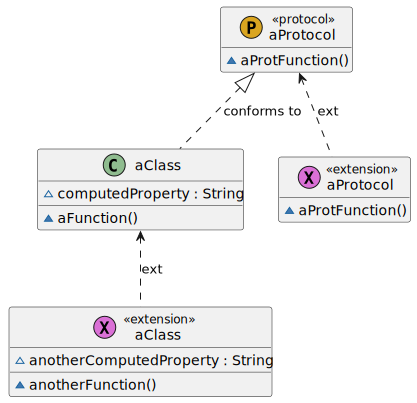
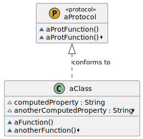
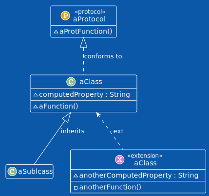
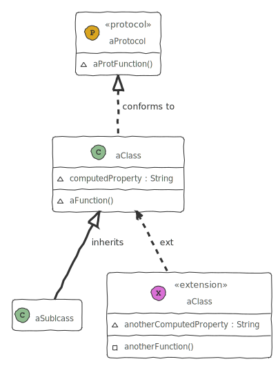

# SwiftPlantUML

Generate UML class diagrams from swift code with this Command Line Interface (CLI) and Swift Package.

[](https://github.com/MarcoEidinger/SwiftPlantUML/workflows/Swift)
[](https://codecov.io/gh/MarcoEidinger/SwiftPlantUML)
[](https://codebeat.co/projects/github-com-marcoeidinger-swiftplantuml-main)
[](https://marcoeidinger.github.io/SwiftPlantUML/)
[](https://github.com/MarcoEidinger/SwiftPlantUML-Xcode-Extension)
[](http://twitter.com/MarcoEidinger)
[](https://bestpractices.coreinfrastructure.org/projects/5206)

Use one or more Swift files as input for a diagram to visualize `class`, `struct`, `protocol`, `enum` and `extension` types
with their instance and static members as well as their inheritance and implementation relationships


<details>
  <summary><strong>Table of Contents</strong> (click to expand)</summary>

<!-- toc -->

- [SwiftPlantUML](#swiftplantuml)
  - [Usage](#usage)
    - [Command Line](#command-line)
    - [Swift package](#swift-package)
    - [Xcode source editor extension](#xcode-source-editor-extension)
  - [Installation](#installation)
    - [Using Homebrew](#using-homebrew)
    - [Using Mint](#using-mint)
    - [Installing from source](#installing-from-source)
    - [Note: Working with Multiple Swift Versions](#note-working-with-multiple-swift-versions)
  - [Configuration](#configuration)
    - [Options](#options)
      - [Theming](#theming)
    - [Examples](#examples)
    - [Code Completion during Editing](#code-completion-during-editing)
  - [Large Diagrams](#large-diagrams)
  - [Generate UML documentation from a binary framework](#generate-uml-documentation-from-a-binary-framework)
  - [Planned improvements](#planned-improvements)
  - [Known limitations](#known-limitations)
  - [Logging](#logging)
  - [Manual page](#manual-page)
  - [Acknowledgements](#acknowledgements)

<!-- tocstop -->

</details>

## Usage

### Command Line

Example to generate and render diagram, based on a single Swift file, in your browser:

```
swiftplantuml ./Tests/SwiftPlantUMLFrameworkTests/TestData/basics.txt
```

Run `swiftplantuml` in the directory containing the Swift files to be considered for diagram generation. Directories
will be searched recursively.

```
$ swiftplantuml classdiagram --help
OVERVIEW: Generate PlantUML script and view it and diagram in browser

USAGE: swift-plant-uml classdiagram [--config <config>] [--exclude <exclude> ...] [--output <format>] [--sdk <sdk>] [--verbose] [<paths> ...]

ARGUMENTS:
  <paths>                 List of paths to the files or directories containing
                          swift sources

OPTIONS:
  --config <config>       Path to custom configuration filed (otherwise will
                          search for `.swiftplantuml.yml` in current directory)
  --exclude <exclude>     paths to ignore source files. Takes precedence over
                          arguments
  --output <format>       Defines output format. Options: browser,
                          browserImageOnly, consoleOnly
  --sdk <sdk>             MacOSX SDK path used to handle type inference
                          resolution, usually `$(xcrun --show-sdk-path -sdk
                          macosx)`
  --hide-extensions/--merge-extensions/--show-extensions
                          Decide if/how Swift extensions shall be considered for class diagram generation (default:
                          hideExtensions)
  --verbose               Verbose
  --version               Show the version.
  -h, --help              Show help information.
```

As `classdiagram` is the default subcommand you can omit it.

Note: unknown type in diagrams for variables declared with type inference (e.g. `var hasBasket = false`) *unless* you specify `sdk` argument

<details>
  <summary><strong>Type inference details</strong> (click to expand)</summary>

In the following example the property `hasBasket` is of type `Bool` but the type is inferred and not explicitly declared.

```swift
class Bicycle: Vehicle {
    var hasBasket = false
}
```

SwiftPlantUML requires the macosx SDK in order to properly recognize the inferred type. If you have Xcode installed (which includes the macosx SDK) then use `--sdk $(xcrun --show-sdk-path -sdk macosx)`.

|                    | No inferred type (*default*) | inferred type |
|--------------------|-------------------|-----------------------|
| Generated PlantUML |  `~hasBasket`                 |  `~hasBasket : Bool` 
| Command            | `swiftplantuml classdiagram Tests/SwiftPlantUMLFrameworkTests/TestData/demo.txt`                  | `swiftplantuml classdiagram Tests/SwiftPlantUMLFrameworkTests/TestData/demo.txt --sdk $(xcrun --show-sdk-path -sdk macosx)`                      |                     |

</details>

### Swift package

```swift
dependencies: [
    .package(url: "https://github.com/MarcoEidinger/SwiftPlantUML.git", .upToNextMajor(from: "0.5.0"))
]
```

This project is still in initial development. Generally this anything may change at any time and the public API should not be considered stable). However, I'll try to reserve breaking changes for new minor versions. You might feel more comfortable to pin the version to `.upToNextMinor` or even to an `.exact` version.

[API documentation](https://marcoeidinger.github.io/SwiftPlantUML/)

### Xcode source editor extension

See [MarcoEidinger/SwiftPlantUML-Xcode-Extension](https://github.com/MarcoEidinger/SwiftPlantUML-Xcode-Extension) for more details

## Installation

### Using [Homebrew](https://brew.sh/)

```
brew install swiftplantuml
```

> previously you were able to use `brew install MarcoEidinger/formulae/swiftplantuml` (and you still can)

### Using [Mint](https://github.com/yonaskolb/mint)

```
$ mint install MarcoEidinger/SwiftPlantUML
```

### Installing from source

You can also build and install from source by cloning this project and running
`make install` (Xcode 12 or later).

Manually
Run the following commands to build and install manually:

```
$ git clone https://github.com/MarcoEidinger/SwiftPlantUML.git
$ cd SwiftPlantUML
$ make install
```

### Note: Working with Multiple Swift Versions

SwiftPlantUML hooks into SourceKit and therefore needs a Swift toolschain.

You should always run SwiftPlantUML with the same toolchain you use to compile your code.

You may want to override SwiftPlantUML's default Swift toolchain if you have multiple toolchains or Xcodes installed.

Here's the order in which SwiftPlantUML determines which Swift toolchain to use:

- `$XCODE_DEFAULT_TOOLCHAIN_OVERRIDE`
- `$TOOLCHAIN_DIR or $TOOLCHAINS`
- `xcrun -find swift`
- `/Applications/Xcode.app/Contents/Developer/Toolchains/XcodeDefault.xctoolchain`
- `/Applications/Xcode-beta.app/Contents/Developer/Toolchains/XcodeDefault.xctoolchain`
- `~/Applications/Xcode.app/Contents/Developer/Toolchains/XcodeDefault.xctoolchain`
- `~/Applications/Xcode-beta.app/Contents/Developer/Toolchains/XcodeDefault.xctoolchain`

`sourcekitd.framework` is expected to be found in the usr/lib/ subdirectory of the value passed in the paths above.

So if you encounter **Fatal error: Loading sourcekitd.framework/Versions/A/sourcekitd failed** then please check result of `xcode-select -p` to see if that directory subsequently contains a Swift toolschain. You can use `sudo xcode-select -s <pathToYourXcodeInstallation>` to rectify the situation, e.g. 

`sudo xcode-select -s /Applications/Xcode.app/Contents/Developer`

## Configuration
Configure SwiftPlantUML by adding a `.swiftplantuml.yml` file from the directory you'll run SwiftPlantUML from. Note: the same configuration options can be set programmatically with `Configuration`.

### Options

You are able to
- include/exclude files (wildcards supported)
- include/exclude elements by name (wildcards supported)
- limit elements and members based on their access level, e.g. show only `public` types
- hide extensions or merge extensions (with their known type)

| Show Extensions                                              | Merge Extensions                                             | Hide Extensions                                              |
| ------------------------------------------------------------ | ------------------------------------------------------------ | ------------------------------------------------------------ |
|  |  |  |
| Clutter but represents codebase accurately                   | Reduced clutter. No loss of information                      | No clutter but loss of information                           |

- hide member access level attribute
- configure styles, use [skin parameters](https://plantuml.com/skinparam) and even include external files or [themes](./THEMING.md)
- exclude inheritance relationships based on parent (wildcards supported), e.g. do not show inheritance to `Codable`

#### Theming

|                     Default                     | Amiga                                       | Reddress-darkblue                                            | Sketchy Outline                                              | Many More Available                        |
| :---------------------------------------------: | ------------------------------------------- | ------------------------------------------------------------ | ------------------------------------------------------------ | ------------------------------------------ |
|  |  |  |  | See [here](./THEMING.md) for more examples |

### Examples

Simple Example:

```yml
files:
    exclude:
    - "Tests/**/*.swift" # paths to ignore for diagram. Takes precedence over `included`.
elements:
  havingAccessLevel:
  - public
  - open
  showMembersWithAccessLevel:
  - public
  - open
  showExtensions: false
theme: plain # see https://plantuml.com/theme
skinparamCommands: # see https://plantuml.com/skinparam
- skinparam classBackgroundColor PaleGreen
- skinparam classArrowColor SeaGreen
- skinparam classBorderColor SpringGreen
- skinparam stereotypeCBackgroundColor YellowGreen
- skinparam stereotypeCBackgroundColor<< Foo >> DimGray
relationships:
  inheritance:
    label: "inherits from"
    style:
      lineStyle: dotted
      lineColor: DarkViolet
      textColor: DarkViolet
    exclude:
    - "Codable"
```

Rich example: [here](./Configuration/Examples/Rich/.swiftplantuml.yml)

### Code Completion during Editing


To get code completiong during editing use Visual Studio Code, the [YAML extension created by Red Hat](https://marketplace.visualstudio.com/items?itemName=redhat.vscode-yaml) and the [JSON schema for SwiftPlantUML](./Configuration/Schema/json-schema-swiftplantuml.json).

In Visual Studio Code:  `Code` -> `Preferences` -> `Settings` -> search for yaml


Click on `Edit in settings.json` and add the respective entry:

```json
"yaml.schemas": {"https://raw.githubusercontent.com/MarcoEidinger/SwiftPlantUML/main/Configuration/Schema/json-schema-swiftplantuml.json": "/.swiftplantuml.yml" }
```

## Large Diagrams

Online tools like [PlantText](https://www.planttext.com/) do not support large diagrams. If your diagram image is incompletely rendered (or not visible at all) by PlantText in the browser then 
- [download PlantUML](https://plantuml.com/download) Java archive to your machine
- use `swiftplantuml` to generate the script and
- generate the actual image with `plantuml` locally

Here is the respective command (which assumes that `plantuml.jar` was downloaded in the current directory from which `swifptlantuml` runs)

```bash
swiftplantuml ./Sources/ --output consoleOnly > sources.txt | java -DPLANTUML_LIMIT_SIZE=8192 -jar plantuml.jar $1
```

This will result in the creation of `sources.png` file containing the class diagram up to the size limit.

PlantUML limits image width and height to 4096 with the option to override this limit (`-DPLANTUML_LIMIT_SIZE`) of which I made use in the command above.

In the table below you see the difference of class diagram output based on the same script. FYI: this script/diagram has 63 entities.

|PlantText Output|PlantUML Output (Default Size Limit)|PlantUML Output (Custom Size Limit)|
|---|---|---|
||||

## Generate UML documentation from a binary framework

You can use `swifplantuml` to parse the `.swiftmodule` file of a binary framework, for details and a concrete example please read my article [Generate UML documentation from a binary framework (xcframework)](https://blog.eidinger.info/generate-uml-documentation-from-a-binary-framework-xcframework).

## Planned improvements
- being able to render associations between elements

## Known limitations
See [Large Diagrams](#large-diagrams)

## Logging

CLI will log only error messages per default.

To log messages with lower priority (warning, info, debug) use the `--verbose` option.

Note: using `--output consoleOnly`, to print the PlantUML script in the console, will log any messages into a log file. This has the advantage that you can pipe the PlantUML script into a file without problems. You can tail the log file with `tail -f /tmp/swiftplantuml.log`

## Manual page

Installing `swiftplantuml` with Homebrew or from source (`make install`) will also install a man page which you can view with:

```man swiftplantuml```


## Acknowledgements

This project was inspired by https://github.com/palaniraja and its various predecessors. Out of personal preference I chose to start a new project. I wanted to provide a tool for Swift developers written in Swift! This will hopefully allow me and potential contributors to work on planned improvements faster and more efficient. 

Last but not least a big shoutout to the great developers of [PlantUML](https://github.com/plantuml/plantuml) and the people who operate the related online servers / tools available on http://plantuml.com/ and https://www.planttext.com/ 

