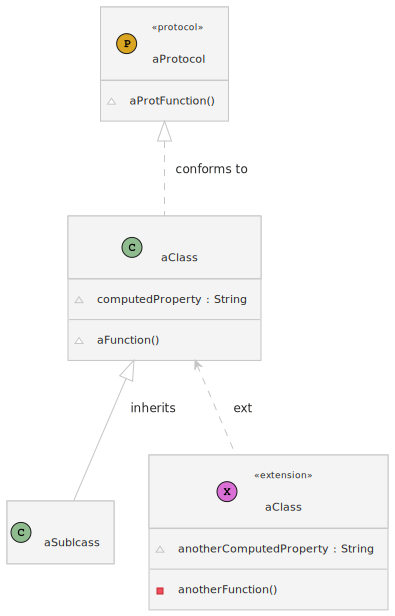
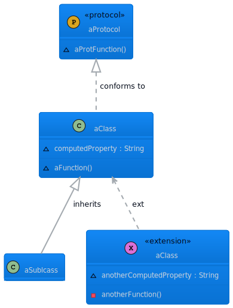
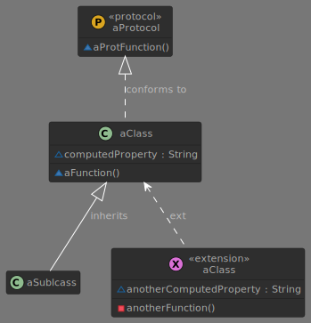
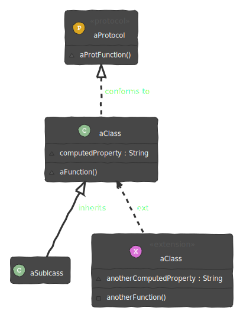

# Theming

> Customize your diagrams with themes

SwiftPlantUML generates PlantUML scripts and therefore supports its [theming capabilities](https://plantuml.com/theme) that are well documented. In a nutshell:

- None (default theme)
- Standard themes available in PlantUML
- Local themes
- Themes from the Internet

SwiftPlantUML will add the required `!theme` directive if you specify the respective element in your `.swiftplantuml.yml` configuration file.

```yaml
theme: amiga
```

will result in a generated PlantUML script that contains the `!theme` directive

```
@startuml
!theme amiga
class Example {}
@enduml
```

## None / Default Theme

No configuration in `.swiftplantuml.yml` configuration file is needed.


## Recommended Standard Themes

PlantUML ships with a variety of themes. Some do not work well with class diagrams. Here is a list of examples that DO work well with class diagrams.

| Name              | Configuration                                                | Example                                                      |
| ----------------- | ------------------------------------------------------------ | ------------------------------------------------------------ |
| amiga             | Add ```theme: amiga``` as top level element into your `.swiftplantuml.yml` file<br /> |                   |
| carbon-gray       | Add ```theme: carbon-gray``` as top level element into your `.swiftplantuml.yml` file<br /> |       |
| cloudscape-design | Add ```theme: cloudscape-design``` as top level element into your `.swiftplantuml.yml` file<br /> |  |
| Mars              | Add ```theme: mars``` as top level element into your `.swiftplantuml.yml` file<br /> |                     |
| minty             | Add ```theme: minty``` as top level element into your `.swiftplantuml.yml` file<br /> |                   |
| plain             | Add ```theme: plain``` as top level element into your `.swiftplantuml.yml` file<br /> |                   |
| reddress-darkblue | Add ```theme: reddress-darkblue``` as top level element into your `.swiftplantuml.yml` file<br /> |  |
| sketchy           | Add ```theme: sketchy``` as top level element into your `.swiftplantuml.yml` file<br /> |               |
| sketchy-outline   | Add ```theme: sketchy-outline``` as top level element into your `.swiftplantuml.yml` file<br /> |  |
| toy               | Add ```theme: toy``` as top level element into your `.swiftplantuml.yml` file<br /> |                       |

## Legacy Theme

The previous default theme from PlantUML.


 You cannot set this via `.swiftplantuml.yml` configuration as this is technically not a PlantUML theme.

You have to modify the generated PlantUML script and use `skin rose` directive.

Example

```
@startuml
skin rose
class Example {}
@enduml
```
